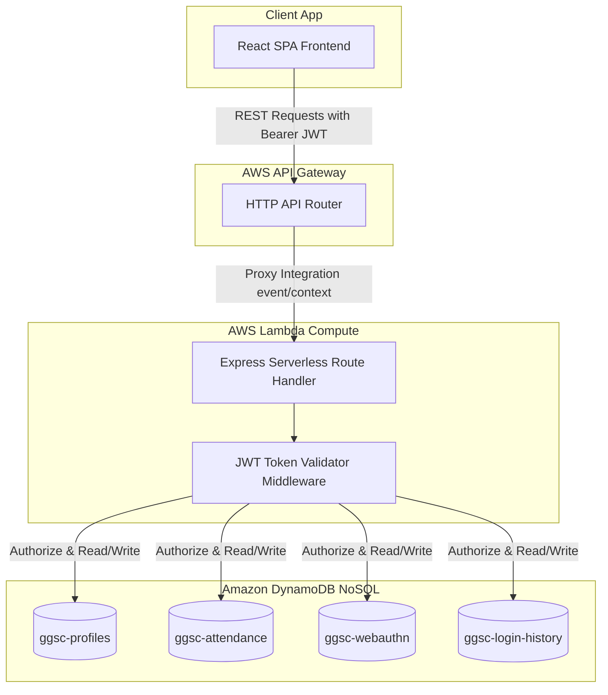
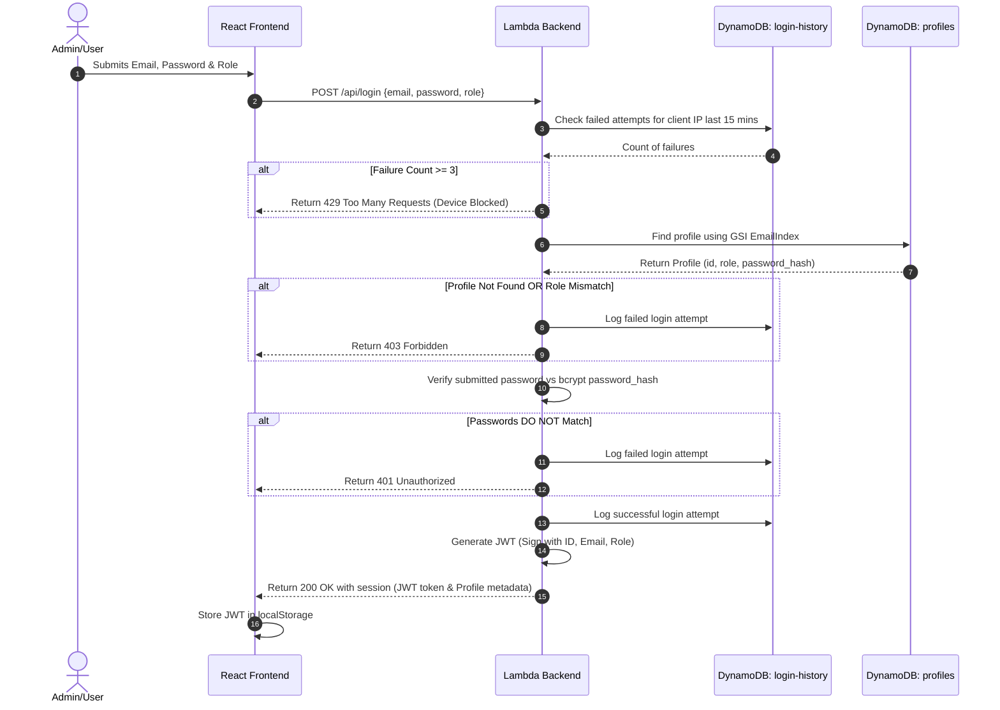
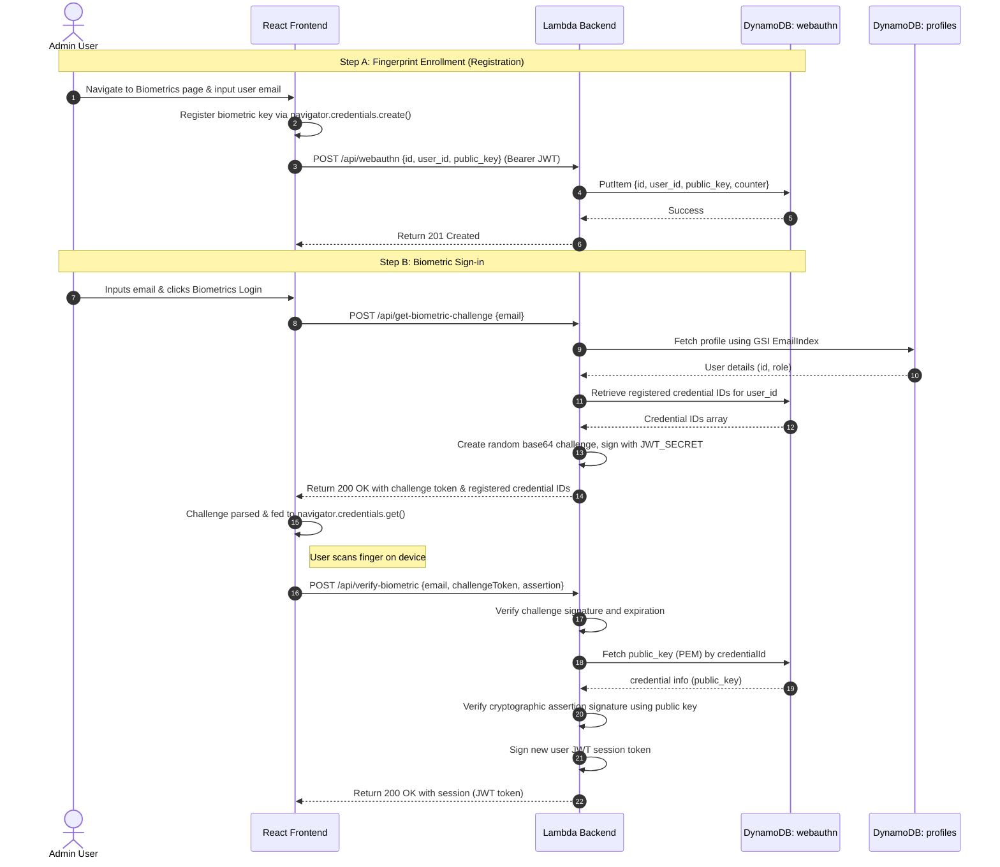
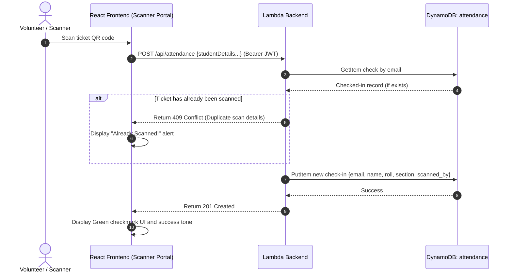
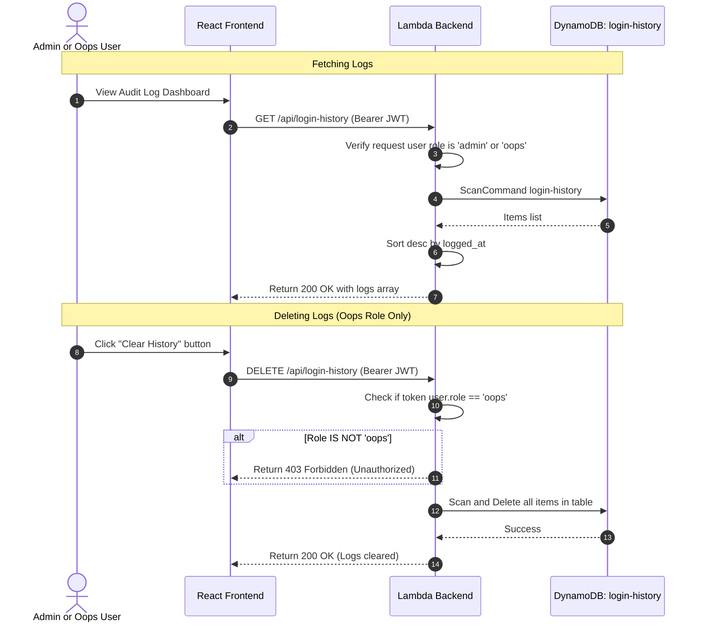

# AWS Serverless Backend: Architecture & Setup Guide

This guide documents the architecture, database configurations, and feature workflows of the migrated **AWS Lambda + Amazon DynamoDB** serverless backend.

---

## 1. Database Setup: Creating DynamoDB Tables

The backend utilizes four DynamoDB tables. You can create them programmatically using the provided setup script.

### Prerequisites: AWS Configuration
Ensure your shell has credentials configured for an AWS account with DynamoDB permissions:
```bash
# Set your AWS Credentials
$env:AWS_ACCESS_KEY_ID="your_access_key_id"
$env:AWS_SECRET_ACCESS_KEY="your_secret_access_key"
$env:AWS_REGION="ap-south-1" # Mumbai region recommended for low latency
```

### Table Initialization Command
Execute the database setup script in the project root:
```bash
node scripts/setup-db.js
```
This script will connect to your AWS account, check if the tables exist, and create them with the required keys and global secondary indexes (GSIs) if they are missing.

### Table Schema Summary

1.  **Profiles Table (`ggsc-profiles`)**:
    *   *Partition Key*: `id` (String - UUID)
    *   *Global Secondary Index*: `EmailIndex` (Partition Key: `email`, String)
2.  **Attendance Table (`ggsc-attendance`)**:
    *   *Partition Key*: `email` (String - ensures unique scans)
3.  **WebAuthn Table (`ggsc-webauthn`)**:
    *   *Partition Key*: `id` (String - Base64URL Credential ID)
    *   *Global Secondary Index*: `UserIdIndex` (Partition Key: `user_id`, String)
4.  **Login History Table (`ggsc-login-history`)**:
    *   *Partition Key*: `id` (String - UUID)
    *   *Global Secondary Index*: `IpAddressIndex` (Partition Key: `ip_address`, String)

---

## 2. Overall Serverless Architecture

The system transitions from client-heavy Supabase calls to a secure API Gateway + AWS Lambda backend proxy, shielding your DynamoDB tables:



---

## 3. Detailed Feature Workflows (Mermaid Diagrams)

### Feature 3.1: Password Login and Token Generation
Verifies credentials using DynamoDB queries against `ggsc-profiles` using the GSI `EmailIndex`, performs rate-limiting checks against `ggsc-login-history`, and generates a secure JSON Web Token (JWT).



---

### Feature 3.2: WebAuthn Fingerprint Registration & Authentication

WebAuthn requires a two-step handshake: Challenge Generation and Assertion/Signature Verification.



---

### Feature 3.3: Attendance Scanning & Duplicate Verification
Prevents scan spoofing or double scanning of tickets by enforcing a unique key constraint on the student's email inside DynamoDB.



---

### Feature 3.4: Audit Log (Login History) Management
Retains a security history of logs. Only members authenticated under the `oops` role can purge logs.



---

## 4. Environment Variables Checklist

Ensure the following environment variables are supplied to your AWS Lambda configuration (e.g. through the AWS Console, AWS CLI, or Serverless CLI configuration):

| Key | Example Value | Description |
| :--- | :--- | :--- |
| `JWT_SECRET` | `your-secure-jwt-signature-key` | HMAC signing secret for session tokens |
| `AWS_REGION` | `ap-south-1` | Target region for DynamoDB calls |
| `CLOUDINARY_CLOUD_NAME` | `your_cloud_name` | Event ticket storage configuration |
| `CLOUDINARY_API_KEY` | `your_api_key` | Cloudinary credentials |
| `CLOUDINARY_API_SECRET` | `your_api_secret` | Cloudinary secret |

---

## 5. Backend Implementation Files

The following files represent the backend implementation of this serverless project:

*   [api/lambda.js](file:///c:/Codes/ggsc/ggsc/api/lambda.js): Express-wrapped Lambda handler with all routes, business logic, rate-limiting, and WebAuthn validation.
*   [serverless.yml](file:///c:/Codes/ggsc/ggsc/serverless.yml): Stack orchestration, mapping routes to API Gateway, declaring tables IAM execution role policies, and environments.
*   [scripts/setup-db.js](file:///c:/Codes/ggsc/ggsc/scripts/setup-db.js): Database migration helper to programmatically deploy and check DynamoDB tables and GSIs on AWS.
*   [package.json](file:///c:/Codes/ggsc/ggsc/package.json): Declares backend dependencies such as `@aws-sdk/client-dynamodb`, `@aws-sdk/lib-dynamodb`, `bcryptjs`, `jsonwebtoken`, and `serverless-http`.

---

## 6. Frontend Portal Integration Files

The following React portal integration files directly connect with the backend:

*   [src/lib/apiClient.js](file:///c:/Codes/ggsc/ggsc/src/lib/apiClient.js): Centralized HTTP wrapper that handles endpoint routing, parsing payloads, and forwarding authorization Bearer JWT tokens.
*   [src/components/Admin/AdminLogin.jsx](file:///c:/Codes/ggsc/ggsc/src/components/Admin/AdminLogin.jsx): Interfaces with credential validation endpoints and performs browser WebAuthn biometric queries.
*   [src/components/Admin/AdminDashboard.jsx](file:///c:/Codes/ggsc/ggsc/src/components/Admin/AdminDashboard.jsx): Handles global user authorization checks using backend session validation.
*   [src/components/Admin/AttendancePortal.jsx](file:///c:/Codes/ggsc/ggsc/src/components/Admin/AttendancePortal.jsx): Records scanned attendees, checks duplicates, and lists scan logs.
*   [src/components/Admin/BiometricEnrollment.jsx](file:///c:/Codes/ggsc/ggsc/src/components/Admin/BiometricEnrollment.jsx): Admin interface to list users, load enrolled public keys, verify administrative passwords, and register/remove WebAuthn credentials.
*   [src/components/Admin/LogHistory.jsx](file:///c:/Codes/ggsc/ggsc/src/components/Admin/LogHistory.jsx): Administrative audit workspace to review login attempts, clear logs, and delete single entries.
*   [src/components/Admin/TicketGeneratorPortal.jsx](file:///c:/Codes/ggsc/ggsc/src/components/Admin/TicketGeneratorPortal.jsx): Admin utility to generate QR tickets and upload images to Cloudinary.
